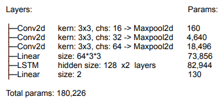
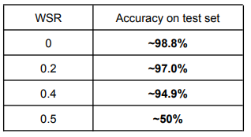
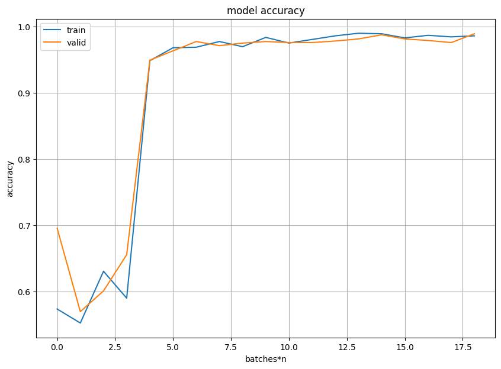
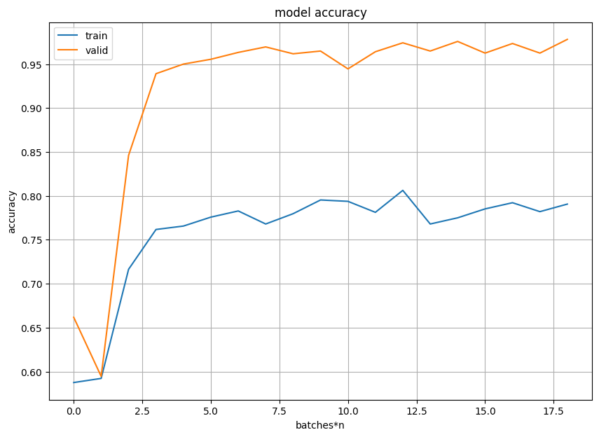
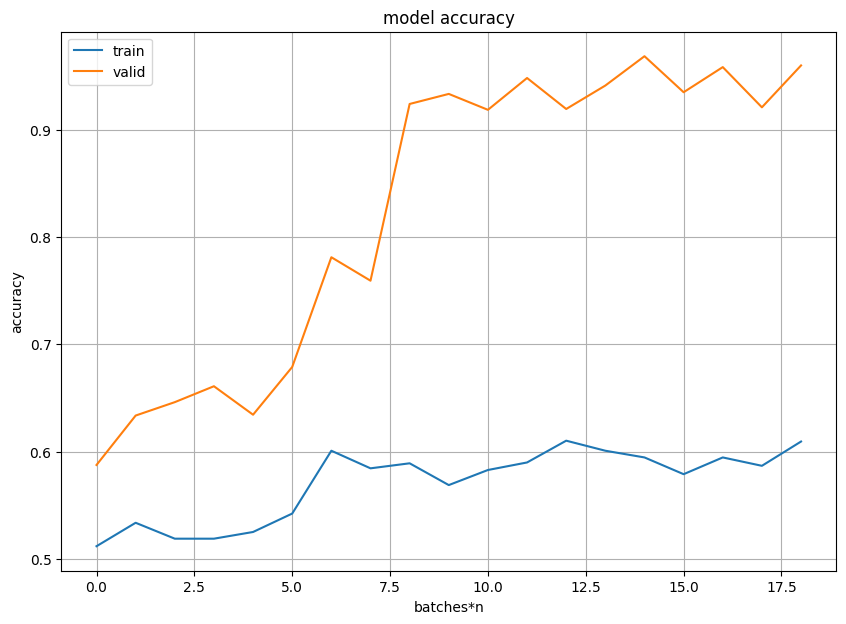

# Seq-classification-pytorch

This is a simple implementation of LSTM model that is able to distinguish sequences of digits (MNIST) images with a length of 3 - 30. 
The model was trained for 1 epoch containing 60k examples (After this 1 epoch, the model does not significantly improve the accuracy).

### Model:

## Results

For a clean dataset model achieves 98.8% accuracy for a validation set.

There is also applied weak supervision scenario, in that way, that generator generates random labels with defined probability WSR. WSR = 0.2 means that labels of 20% random examples will be swapped.

## Conclusions

Model has achieved 98.8% accuracy on binary sequence classification task (made of MNIST), which is not a very high result taking into consideration that a very simple convolution network can achieve similar accuracy, but with 10 classes instead of 2.
Probably it may be due to the fact that it is a recurrent neural network that is harder to train.
Model achieves similar results for different sequence lengths (from a range 3 to 30).

Possible improvements:

There are many ways and things to improve. 

* The dataset can be balanced. I did not do this since the probability of occurrence of digit 4 in sequence of 10 digits with avg length = 10 and std = 3 (where min length = 3 and max length = 30) is about 61%, so the dataset is not unbalanced significantly.
* Pretrained network can be used (such as VGG, resnet, mobilenet) before LSTM layers.
* Model can be built using state of the art architecture (residual, inception).
* Simple regularization methods like dropout, gaussian noise and batch normalization for speed up training and reduce vanishing gradient when using deeper nets.
* Model can be tested with other metrics considering precision and recall (such as f1, f2), when the dataset would be more imbalanced.

